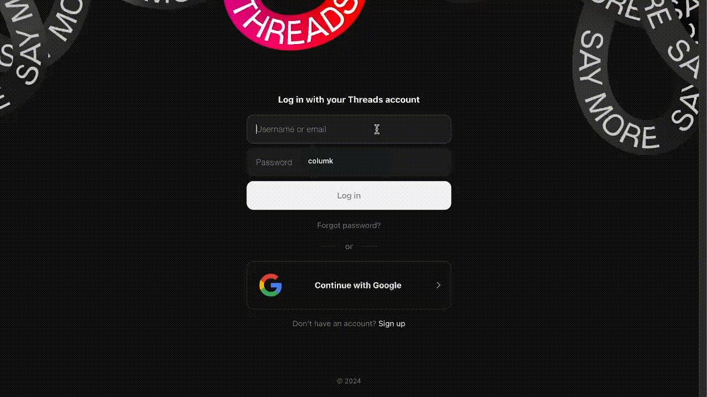
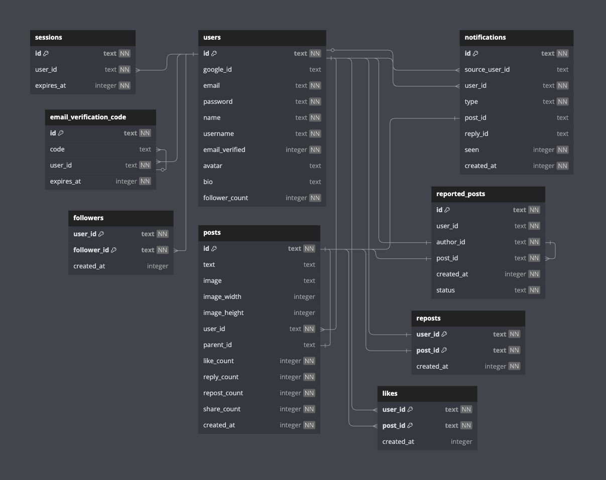

<a name="readme-top"></a>

<h3 align="center">Threads Clone</h3>
<p align="center">
  <b><a href="https://threads-clone-omega-bay.vercel.app/" >threads-clone-omega-bay.vercel.app/</a></b>
  </p>
  <p align="center">
  A clone of Threads using Next.js 15, React 19 and Drizzle ORM.
  </p>
</div>

<!-- ABOUT THE PROJECT -->

[![Home Page Screenshot][home-screenshot]](https://threads-clone-omega-bay.vercel.app/)

## About The Project

This was an attempt to really nail the look and feel of a popular social media app while gaining experience with TypeScript, SQL, auth, server-side React, integration testing and end-to-end testing. 

The UI/UX should be almost identical to Threads, apart from a few differences in caching and polling behaviour.

Threads doesn't have email/password signup so I referenced Meta's other products for UX there. I also went with Google OAuth instead of Instagram because Meta has deprecated their OAuth APIs.

### Key Features
* **Create Threads**: Post threads with text and image content.
* **Interactions**: Follow users and like, save, share, repost and reply to threads. 
* **Feed Customization**: Feeds for followed users, liked threads, saved threads, user's threads, replies and reposts.
* **Notifications**: Receive notifications for likes, replies, reposts and new followers via polling.
* **Profile Management**: Users can update profile information, including bio and avatar.
* **Search**: Search for users or threads.
* **Content Moderation**: Users can report threads. Text or image content flagged by AI will be automatically removed.
* **Public Content**: Users can view and search threads and profiles without needing an account
* **Accessibility**: An inclusive experience with support for assistive technologies and keyboard-only navigation.

### Additional Features
* **Authentication**: Custom auth with email-verification and OAuth.
* **Automated Testing**: Comprehensive test suite including unit, integration and end-to-end tests using Vitest and Playwright.
* **Optimistic UI**: Instant feedback for interactions.
* **Performance Optimization**: Server components and caching strategies for client and server.
* **Form Validation**: Real-time form validation with live feedback from client and server.
* **Modular Architecture**: Application structured into layers for modularity and maintainability.
* **Type Safety**: Typescript with RPC for type-safe communication between client, server and database.

<!-- APP PREVIEW -->

## App Preview



<!-- DATA MODELS -->

## Data Models




<!-- GETTING STARTED -->

## Getting Started

To get a local copy up and running follow these steps

### Prerequisites

#### 1. **Database Setup:** 
Set up an SQLite database using one of the following methods:

- **Option A:** Create a new SQLite (libSQL) database on Turso
- **Option B:** Use a local file in the db client: 'file:mydatabase.db'

#### 2. **Cloudinary Setup:** 
Create a project on [Cloudinary](https://cloudinary.com/)

#### 3. **Google OAuth Setup:**
Create a project with OAuth 2.0 Credentials in the [Google Cloud Console](https://console.cloud.google.com/)

#### 4. **Ethereal Setup:**
Create an account on [Ethereal](https://ethereal.email/)

#### 5. **OpenAI Setup:**
Create an account on [OpenAi's API Platform](https://platform.openai.com/) and add credits

### Installation

1. Clone the repo
   ```sh
   git clone https://github.com/columk1/threads-clone.git
   ```
2. Install NPM packages
   ```sh
   pnpm install
   ```
3. Set up .env file using `env.example` for reference

4. Run tests
   ```sh
   pnpm run test
   pnpm run test:e2e
   ```
5. Start the development server
   ```sh
   pnpm run dev
   ```

## Additional Info

**Note:** I used a [starter template](https://github.com/ixartz/Next-js-Boilerplate) for this project, which I gutted around 95% of. I had initially cloned it to see how they implemented i18n, but I became intrigued by their commit hooks, linting, logging, error-monitoring, chrons, actions etc. I decided to start from there to get a better feel for those integrations. 

I removed almost everything eventually, but it was interesting to see how it all fit together.

<!-- ROADMAP -->

<!-- CONTACT -->

## Contact

Email: columk1@gmail.com  
Bluesky: [@columk.bsky.social](https://bsky.app/profile/columk.bsky.social)  
Website: [columkelly.com](https://columkelly.com)

Live Project Link: [threads-clone-omega-bay.vercel.app](https://threads-clone-omega-bay.vercel.app/)

[home-screenshot]: ./docs/home-screenshot.webp
